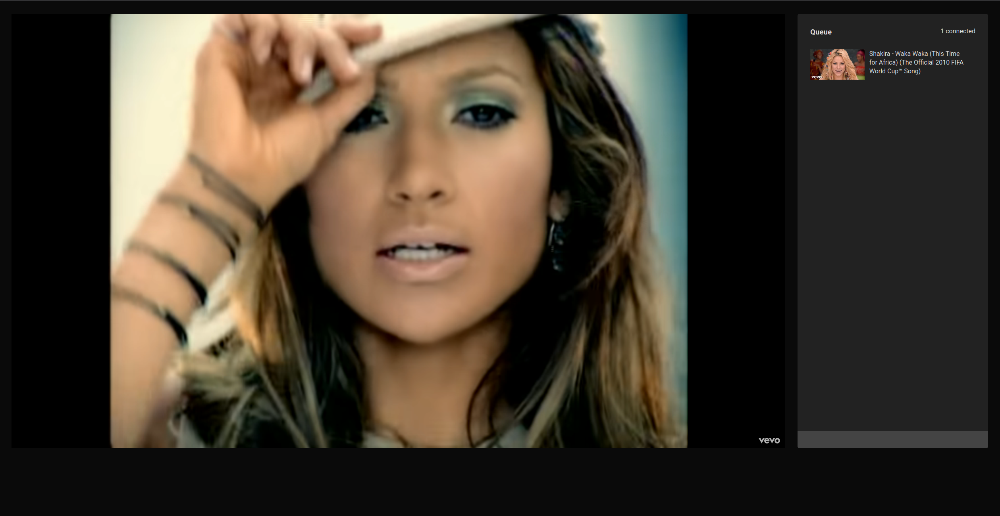

# yt-sync

Allows for synchronous watching of YouTube videos with other humans.
Provides a queue to watch multiple videos one after another.
Go to `https://yt.randomerror.de/` and share the generated link for others to join.

All connected humans can queue, play/pause or seek in the video,
the control is not limited to the creator of the room.
The YouTube player, including all its shortcuts, can be utilized fully.
No popups asking you to create/join a room, no strange external control bar.

Queue videos by YouTube-Link, Youtube-Id or any query.
When entering a query the first search result will be added to the queue,
use at your own risk.

## todo

- playback speed synchronization
- not sure what happens for people without an [ad blocker](https://github.com/gorhill/uBlock/)
- queue sorting
- playlist support
- kick clients that do not respond to `ready?` events

## run on docker

- adapt the `docker-compose.yml` to your needs
- start using `docker-compose up -d`

## build application

- backend

  - to build `cd backend && ./gradlew shadowJar`
  - app will be at `build/libs/yt-sync-all.jar`
  - requires `youtube-dl` to be installed for fetching video info

- frontend
  - change server address in `App.tsx` server constant
  - `cd frontend && yarn && yarn build`
  - serve the `build` folder contents from a webserver
